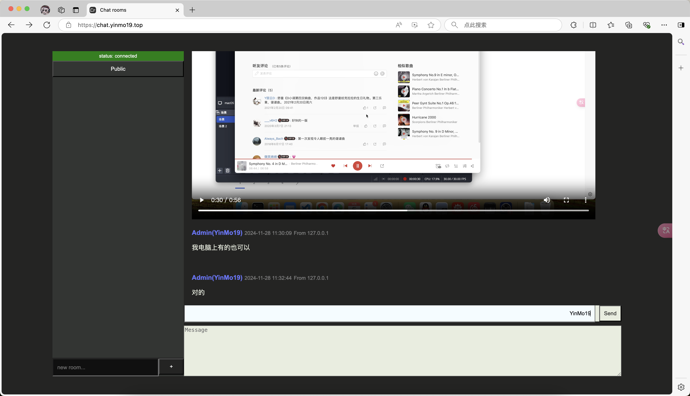

# RUST/Rocket Chatroom
## YinMo19

This is a simple chatroom written in Rust/Rocket.


BASED ON
---
A rocket example project from the official website. I have added some features to it.

Features
---
1. Multiple users connect to the chatroom.
2. Auto reconnection.
3. Storage messages in Sqlite. (Use `sqlx`)
4. Represent the time of messages.
5. Show the ip of the sender.

TODO
---
- [ ] Add protection of the frontend.
- [ ] Add mobile phone UI support.
- [ ] ...

Build and run
---
ensure you have installed `rustup` and `cargo`. If you have rust environments getted ready, you can build and run the backend project with the following commands:
```sh
cargo build
cargo run
```
the default host and port is `127.0.0.1, 8000`. You can change it by adding env variables:
```sh
ROCKET_ADDRESS=0.0.0.0 ROCKET_PORT=80 cargo run
```

After all tests passed, you can build with release. Just build with `cargo build --release`.

Frontend
---
In root directory, run `npm install` to install dependencies. My frontend skill is bad, sorry :(
